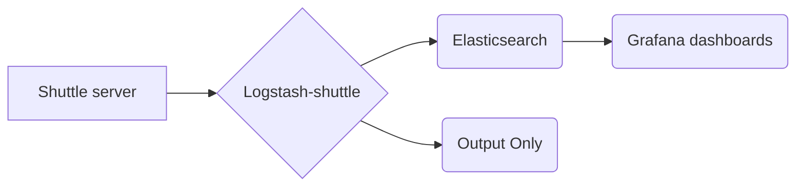

 
# Logstash-shuttle

**Logstash-shuttle** is a docker image  based on [logstash](https://hub.docker.com/r/library/logstash/tags/) official image and customized to parse and treat **Shuttle** logs as event streams for later analysis . 
For further reading please refer to https://12factor.net/logs.

The image is aimed to be used along side  a Shuttle server and points to it's log directory , but in order to produce an [ephemeral](https://docs.docker.com/develop/develop-images/dockerfile_best-practices/#containers-should-be-ephemeral) container you can use it with only a named volume.
```yaml
registry.shuttle-cloud.com:5000/slaheddinne.ahmed/logstash-shuttle:1.0.1
``` 
## Usage
#### Available commands  : 
   `-- run` runs the image
   `-- help` shows avaible commands and environement variables.
#### Environement variables
|Variable |Description  |Default value  |
|--|--|--|
|  STACK_CLIENT| Identifies a client logs  |mystack |
|  EL_HOST| Elasticsearch host  |es|
|  EL_PORT| Elasticsearch port  |9200|
| SHUTTLE_VERSION| Specifies the shuttle version. 47 for 4.7 , 48 for 4.8 etc  |47|
|  FILE_DIR| Specifies the directory where logs are located in shuttle volume |/data/shuttle/home/logs/audit. The default Shuttle audit directory|
|  FILE_NAME| Specifies the file(s) to be parsed/treated. you can use regex |'ShuttleAudit.csv.2018*'|
|  EL_INDEX|elasticsearch index where logs will be stored|staging_prod|
|  OUTPUT_ONLY| If set to true you will get the logs in the standard output else to elasticsearch |false|
|  SINCE_DB| Set it to `sincedb_path => "/dev/null"` to force logstash-shuttle to read files from the begining even if they have been seen already.|


## Getting Started

These instructions will get you a copy of  the project on your local machine for development and testing purposes.

### Prerequisites
Docker installed on your local machine.
Grafana running server to load the dashboards from json files.
```
Give examples
```

### Installing

A step by step series of examples that tell you have to get a development env running
 1. Download or clone the repository. 
 2. Run elasticsearch first

```
cd test-example/elasticsearch
docker-compose up -d
```
3. Then run shuttle stack
```
cd test-example/shuttle
docker-compose up -d
```


## Running the tests

This section aims to describe how to check if everything works as expected.

1 -  Run `docker ps `, you should be able to see 4 running containers (Shuttle server, Postgres , Logstash-shuttle and Elasticsearch).
2 - Check **logstash-shuttle** logs with `docker logs shuttle_logstash_1` , to see if elasticsearch and logstash-shuttle are linked. 
> INFO  logstash.outputs.elasticsearch - New Elasticsearch output {:class=>"LogStash::Outputs::ElasticSearch", :hosts=>["//es:9200"]}
> INFO  logstash.agent - Successfully started Logstash API endpoint {:port=>9600}


## Versioning

I use [Github](https://github.com/) for versioning. For the versions available, see the [releases on this repository](https://github.com/slassh/logstash-shuttle/releases). 

## Authors

* **Slaheddinne Ahmed** 
Contact : slaheddinne.ahmed@kshuttle.io

## Flow chart

